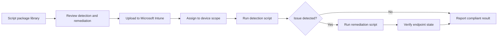

<!-- jr-brand:start -->

  
  <h1>Endpoint Analytics Remediation Scripts</h1>
  
<strong>Ready-to-use Microsoft Intune Endpoint Analytics Proactive Remediation detection and remediation scripts.</strong>

  

  
  
  
  
  

  
Open-Source Collection · PowerShell · Practical by design

<!-- jr-brand:end -->

**The largest community-driven collection of Intune Endpoint Analytics remediation scripts.**

Detect. Remediate. Automate.

## Overview

This repository provides a growing library of **production-ready** detection and remediation scripts for [Microsoft Intune Endpoint Analytics](https://learn.microsoft.com/en-us/mem/analytics/proactive-remediations). Each script package includes a detection script and (where applicable) a remediation script that you can deploy directly to your environment.

> **Browse the folders above** to explore all available scripts -- from security hardening and Defender configuration to disk cleanup, Teams management, and more.

<!-- project-context:start -->
## Project Context

Endpoint Analytics Remediation Scripts is a deployable script library for Intune administrators who want ready-to-use detection and remediation packages. The repository is organized around script folders, where each package can be reviewed, tested, and then deployed through Microsoft Intune proactive remediations.

- Use it when endpoint issues should be detected automatically and remediated consistently.
- Each script package is designed to separate detection from remediation so administrators can validate behavior before rollout.
- The repository acts as both a community script catalog and a practical deployment reference.

## How It Works

Administrators pick a script package, review the detection and remediation logic, upload it to Intune, and assign it to the intended device scope. Endpoints run detection first; remediation runs only when the detection result indicates that action is needed.

<!-- project-context:end -->

## Quickstart

### Deploy a script package in Intune

1. Open the [**Intune Portal**](https://intune.microsoft.com/) and navigate to **Devices** > **Scripts and remediations**

2. Click **+ Create**

   

3. Enter a **Name**, **Description**, **Publisher**, and **Version**, then click **Next**

   

4. Upload the **Detection script** (and optionally the **Remediation script**), then click **Next**

   

5. Configure **Scope tags** and **Assignments**, then click **Review + create**

   

## Contributing

We love contributions from the Intune community! Here's how you can help:

| | How to contribute |
|---|---|
| **Got an idea?** | [Open an issue](https://github.com/JayRHa/EndpointAnalyticsRemediationScripts/issues/new) describing the script you'd like to see |
| **Got a script?** | Use the template in [`0 - Template`](./0%20-%20Template) and submit a pull request |

## Contributors

Thanks to everyone who has contributed to this project!

### Disclaimer

*This is a community repository. There is no guarantee for the scripts provided here.*
*Please review and test thoroughly before deploying to production environments.*

 

**If this repo helps you, consider giving it a :star:**

## License

This project is available under the terms in [LICENSE](LICENSE).

<!-- jr-brand-footer:start -->

---

  
Built and maintained by <a href="https://jannikreinhard.com/">Jannik Reinhard</a> · Microsoft MVP for Security and AI Platform.

  
<a href="https://www.buymeacoffee.com/jannikreinf">Support the open-source work</a>

  
<strong>Stay healthy, Cheers Jannik</strong>

<!-- jr-brand-footer:end -->
